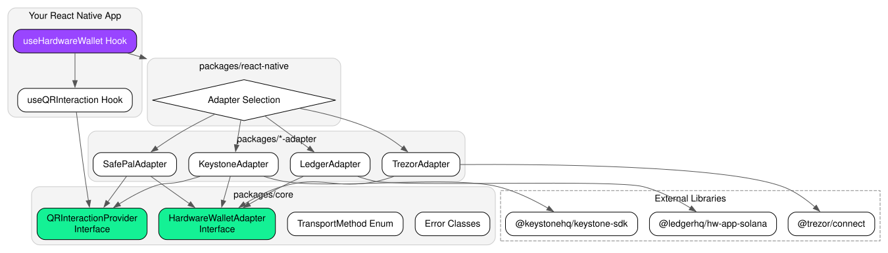

# Solana Unified Hardware Wallet SDK for React Native

An open-source, modular adapter system that lets React Native Solana dApps connect and interact with multiple hardware wallets through a unified API.

## 🌟 Supported Hardware Wallets

| Wallet               | Transport Methods  | Connection Type          |
| -------------------- | ------------------ | ------------------------ |
| **Ledger**           | USB, Bluetooth     | Direct transport         |
| **Trezor**           | USB                | Trezor Connect bridge    |
| **Keystone**         | QR Code            | Air-gapped (UR protocol) |
| **SafePal**          | QR Code, Bluetooth | QR bridge / BLE          |
| **Tangem**           | NFC                | Direct NFC transport     |
| **Unruggable**       | NFC, Bluetooth     | Mobile app proxy / NFC   |
| **Solflare Shield**  | USB, Bluetooth     | Direct connection        |

## 🏗 Architecture Overview

This project is a **pnpm monorepo** powered by **Turborepo**. It uses the **Adapter Pattern** to abstract hardware-specific communication behind a common `HardwareWalletAdapter` interface.



### Package Structure

```text
packages/core                       → Base types: HardwareWalletAdapter, TransportMethod, errors
packages/ledger-adapter             → Ledger Nano (USB/BLE) via @ledgerhq/hw-app-solana
packages/trezor-adapter             → Trezor T/One (USB) via @trezor/connect
packages/keystone-adapter           → Keystone (QR) via @keystonehq/keystone-sdk + UR protocol
packages/safepal-adapter            → SafePal (QR/BLE) via proprietary JSON bridge protocol
packages/tangem-adapter             → Tangem (NFC) direct hardware bindings
packages/unruggable-adapter         → Unruggable (NFC/BLE) native bindings
packages/solflare-shield-adapter    → Solflare Shield (USB/BLE) native transport
packages/react-native               → useHardwareWallet + useQRInteraction hooks
apps/demo                           → React Native demo app showcasing all 7 wallets
apps/cli                            → Node.js CLI testing tool for programmatic usage
```

## 🚀 Getting Started

### Prerequisites

- **React Native** ≥ 0.72 with **Bare workflow** or **Expo Dev Build**
- **Node.js** ≥ 18
- Standard Expo Go is NOT supported (native BLE/Camera modules required)

### Installation

Install only the adapters your dApp needs:

```bash
# Core + hooks (always required)
npm install @solana-wallet-sdk/core @solana-wallet-sdk/react-native

# Pick your wallet adapter(s)
npm install @solana-wallet-sdk/ledger-adapter           # Ledger
npm install @solana-wallet-sdk/trezor-adapter           # Trezor
npm install @solana-wallet-sdk/keystone-adapter         # Keystone
npm install @solana-wallet-sdk/safepal-adapter          # SafePal
npm install @solana-wallet-sdk/tangem-adapter           # Tangem
npm install @solana-wallet-sdk/unruggable-adapter       # Unruggable
npm install @solana-wallet-sdk/solflare-shield-adapter  # Solflare Shield
```

#### Ledger BLE (React Native)

```bash
npm install @ledgerhq/hw-transport-react-native-ble react-native-ble-plx
cd ios && pod install
```

#### Keystone / SafePal QR

```bash
npm install react-native-vision-camera react-native-qrcode-svg
```

### Basic Usage

```tsx
import {
  useHardwareWallet,
  TransportMethod,
} from "@solana-wallet-sdk/react-native";
import { LedgerAdapter } from "@solana-wallet-sdk/ledger-adapter";
import TransportBLE from "@ledgerhq/hw-transport-react-native-ble";

const ledger = new LedgerAdapter(TransportBLE);

export default function App() {
  const { connect, publicKey, signTransaction, signMessage } =
    useHardwareWallet({
      adapters: [ledger],
      defaultDerivationPath: "m/44'/501'/0'/0'",
    });

  return (
    <Button
      title="Connect Ledger"
      onPress={() => connect("Ledger", TransportMethod.BLUETOOTH)}
    />
  );
}
```

### QR-Based Wallets (Keystone / SafePal)

```tsx
import {
  useHardwareWallet,
  useQRInteraction,
  TransportMethod,
} from "@solana-wallet-sdk/react-native";
import { KeystoneAdapter } from "@solana-wallet-sdk/keystone-adapter";

export default function App() {
  const { qrProvider, qrData, isScanning, onQRScanned, onQRDisplayDone } =
    useQRInteraction();
  const keystone = useMemo(() => new KeystoneAdapter(qrProvider), [qrProvider]);
  const { connect, publicKey } = useHardwareWallet({ adapters: [keystone] });

  return (
    <>
      {qrData && <QRCodeView data={qrData} onDone={onQRDisplayDone} />}
      {isScanning && <QRScanner onScan={onQRScanned} />}
      <Button
        title="Connect Keystone"
        onPress={() => connect("Keystone", TransportMethod.QR)}
      />
    </>
  );
}
```

## 📘 API Reference

### `TransportMethod` (enum)

| Value       | Description                 |
| ----------- | --------------------------- |
| `USB`       | Wired USB/OTG connection    |
| `BLUETOOTH` | BLE wireless connection     |
| `NFC`       | Near-Field Communication    |
| `QR`        | QR code air-gapped exchange |

### `HardwareWalletAdapter` (interface)

Every adapter implements this contract:

| Property / Method           | Type                  | Description                                  |
| --------------------------- | --------------------- | -------------------------------------------- |
| `name`                      | `string`              | Human-readable wallet name                   |
| `transportMethods`          | `TransportMethod[]`   | Supported transport methods                  |
| `connect(method)`           | `Promise<void>`       | Open connection via the given transport      |
| `disconnect()`              | `Promise<void>`       | Close connection and release resources       |
| `deriveAccount(path)`       | `Promise<PublicKey>`  | Derive key at BIP-44 path                    |
| `signTransaction(tx, path)` | `Promise<T>`          | Sign `Transaction` or `VersionedTransaction` |
| `signMessage(msg, path)`    | `Promise<Uint8Array>` | Sign arbitrary bytes (SIWS)                  |

### `QRInteractionProvider` (interface)

Callback contract for air-gapped adapters. Injected into Keystone and SafePal constructors:

| Method                  | Description                        |
| ----------------------- | ---------------------------------- |
| `displayQR(data, type)` | Render a QR code to the user       |
| `scanQR(expectedTypes)` | Activate camera and scan a QR code |

### `useHardwareWallet(options)` (hook)

**Options:**

- `adapters`: `HardwareWalletAdapter[]` — Array of adapter instances
- `defaultDerivationPath?`: `string` — Default BIP-44 path (default: `m/44'/501'/0'/0'`)

**Returns:**
| Property | Type | Description |
|----------|------|-------------|
| `connect(name, method)` | `(string, TransportMethod) => Promise<void>` | Connect to a named adapter |
| `disconnect()` | `() => Promise<void>` | Disconnect active adapter |
| `deriveAccount(path)` | `(string) => Promise<PublicKey>` | Derive a different account |
| `signTransaction(tx, path?)` | `(T, string?) => Promise<T>` | Sign a transaction |
| `signMessage(msg, path?)` | `(Uint8Array, string?) => Promise<Uint8Array>` | Sign a message |
| `publicKey` | `PublicKey \| null` | Current derived public key |
| `activeAdapter` | `HardwareWalletAdapter \| null` | Currently connected adapter |
| `isConnecting` | `boolean` | Connection in progress |
| `isSigning` | `boolean` | Signing in progress |
| `error` | `Error \| null` | Last error |
| `capabilities` | `AdapterCapabilities[]` | Transport support per adapter |
| `clearError()` | `() => void` | Clear the error state |

### `useQRInteraction()` (hook)

Bridges QR-based adapters to React state:

| Property            | Type                    | Description                              |
| ------------------- | ----------------------- | ---------------------------------------- |
| `qrProvider`        | `QRInteractionProvider` | Inject into Keystone/SafePal constructor |
| `qrData`            | `string \| null`        | QR payload to display                    |
| `qrType`            | `string \| null`        | Type hint for the QR                     |
| `isScanning`        | `boolean`               | Whether scanner should be active         |
| `onQRScanned(data)` | `(string) => void`      | Call when camera decodes a QR            |
| `onQRDisplayDone()` | `() => void`            | Call when user acknowledges displayed QR |

### Error Classes

| Class                           | Description                         |
| ------------------------------- | ----------------------------------- |
| `HardwareWalletError`           | Base error class for all SDK errors |
| `HardwareWalletConnectionError` | Connection or transport failures    |
| `HardwareWalletSignError`       | Signing failures or user rejections |
| `HardwareWalletTimeoutError`    | Operation timeout                   |

### Adapter Constructors

```typescript
// Ledger — inject platform-specific transport
new LedgerAdapter(transportCreator: TransportCreator)

// Trezor — optional manifest configuration
new TrezorAdapter(config?: { email: string; appUrl: string })

// Keystone — inject QR interaction provider
new KeystoneAdapter(qrProvider: QRInteractionProvider)

// SafePal — at least one transport required
new SafePalAdapter(config: {
  qrProvider?: QRInteractionProvider;
  bleTransport?: SafePalBleTransport;
})
```

## ⚠️ Per-Wallet Setup Notes

### Ledger

- The **Solana app must be open** and the device unlocked before calling `connect()`.
- For React Native BLE: install `@ledgerhq/hw-transport-react-native-ble` and `react-native-ble-plx`.
- For Node.js CLI: install `@ledgerhq/hw-transport-node-hid`.
- Android USB requires OTG permissions in `AndroidManifest.xml`.
- iOS BLE requires `NSBluetoothAlwaysUsageDescription` in `Info.plist`.

### Trezor

- **Trezor Bridge** must be running on the host machine (download from [trezor.io](https://trezor.io/trezor-suite)).
- The `manifest` config (email, appUrl) is required by Trezor Connect for rate limiting.
- Trezor Model T and Model One are both supported.
- The firmware must support Solana (firmware ≥ 2.6.0 for Model T).

### Keystone

- Keystone communicates via **animated QR codes** (UR protocol). No cable required.
- You need `react-native-vision-camera` for QR scanning and `react-native-qrcode-svg` for display.
- On the Keystone device: navigate to **Solana** → show the **Sync QR** to import accounts.
- The SDK caches public keys after the initial sync to avoid repeated QR scans.

### SafePal

- SafePal supports both **QR-based** and **Bluetooth** connections.
- QR mode requires camera permissions and a QR rendering library.
- BLE mode requires a `SafePalBleTransport` implementation (platform-specific).
- At least one transport (QR or BLE) must be provided in the constructor config.

### Tangem & Unruggable (NFC)
- Both wallets rely on physical NFC scans. For React Native, ensure you install and configure a library like `react-native-nfc-manager`.
- The Solana iOS capability `NFCReaderUsageDescription` must be provided in `Info.plist`.

### Solflare Shield
- Requires USB-C or Bluetooth configuration similar to Ledger. Ensure standard Bluetooth/USB physical permissions are requested before establishing connection.

## 🛠 Troubleshooting FAQ

**Q: My Ledger fails on Android during USB connect.**
A: Ensure you have explicit OTG permissions in `AndroidManifest.xml` and the Solana app is open. Some cables only support charging — use a data-capable USB-C cable.

**Q: Trezor Connect shows "Manifest not set" error.**
A: Pass a valid `email` and `appUrl` to the `TrezorAdapter` constructor. These are required by Trezor Connect for identification.

**Q: Can I use this with Expo Go?**
A: No. Expo Go doesn't support native modules. Use **Expo Dev Builds** (`expo run:android` / `expo run:ios`) or Bare React Native.

**Q: Keystone QR scanning is slow or unreliable.**
A: Ensure adequate lighting. Use `react-native-vision-camera` v3+ for better frame processing. Animated (multi-frame) QR codes may take a few seconds to fully decode.

**Q: How do I select a different account index?**
A: Call `deriveAccount("m/44'/501'/<INDEX>'/0'")` with your desired index. The `useHardwareWallet` hook updates `publicKey` state automatically.

**Q: Does Trezor support message signing?**
A: Yes. The SDK uses `TrezorConnect.solanaSignMessage()` (requires `@trezor/connect` ≥ v9.4.0 and firmware supporting Solana message signing).

**Q: Transaction signing shows "User rejected" error.**
A: This means the user declined the transaction on the hardware device screen. The SDK throws a `HardwareWalletSignError` in this case — handle it gracefully in your UI.

**Q: How do I run the demo app?**
A: Clone the repo, then:

```bash
pnpm install
cd apps/demo
npx expo run:android  # or expo run:ios
```

## 🧪 Running Tests

```bash
pnpm install
pnpm test               # Run all tests
pnpm test -- --coverage # With coverage report
```

## 📦 Package Structure

```
solana-wallet-sdk/
├── packages/
│   ├── core/                 # Types, interfaces, errors
│   ├── ledger-adapter/       # Ledger USB/BLE
│   ├── trezor-adapter/       # Trezor USB
│   ├── keystone-adapter/     # Keystone QR (air-gapped)
│   ├── safepal-adapter/      # SafePal QR/BLE
│   └── react-native/         # React hooks
├── apps/
│   ├── demo/                 # React Native demo app
│   └── cli/                  # Node.js CLI demo
├── vitest.config.ts          # Test configuration
├── tsconfig.base.json        # Shared TypeScript config
├── pnpm-workspace.yaml       # Workspace packages
└── turbo.json                # Build pipeline
```

## 📄 License

[Apache-2.0](./LICENSE)
